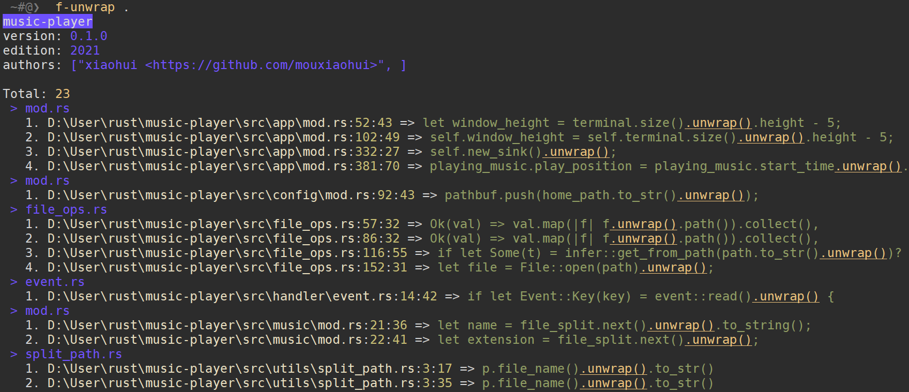

# <p align="center">f-unwrap👁️‍🗨️</p>

<p>检查项目中 unwrap() 使用情况</p>

<div align="center">



</div>

## 🪧Usage

```
USAGE:
    f-unwrap [PATH]

ARGS:
    <PATH>    Project path

OPTIONS:
    -h, --help    Print help information
```
